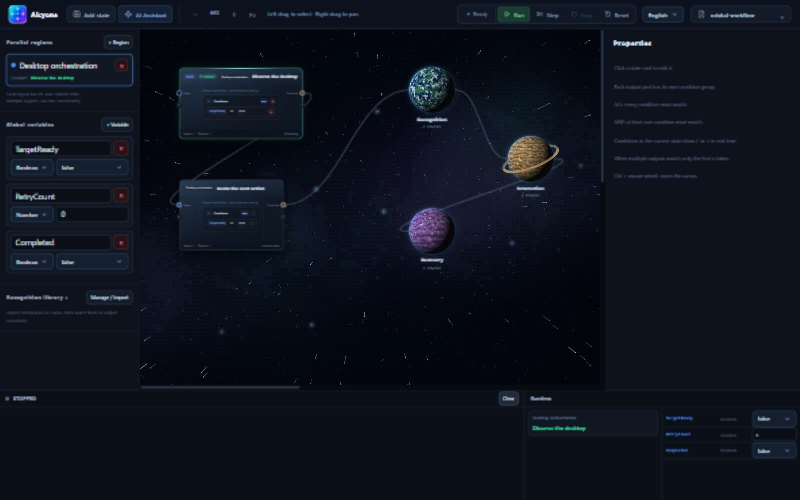
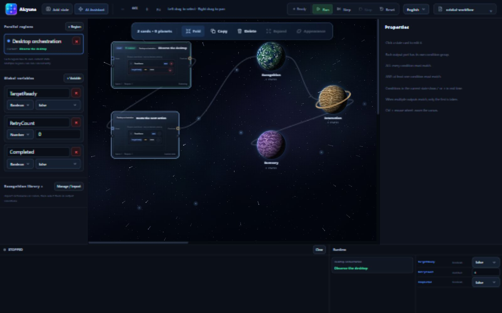
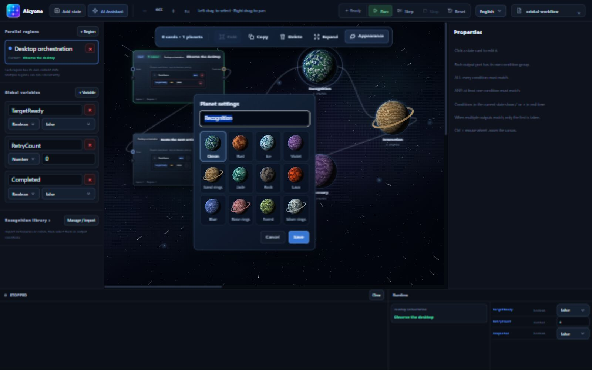
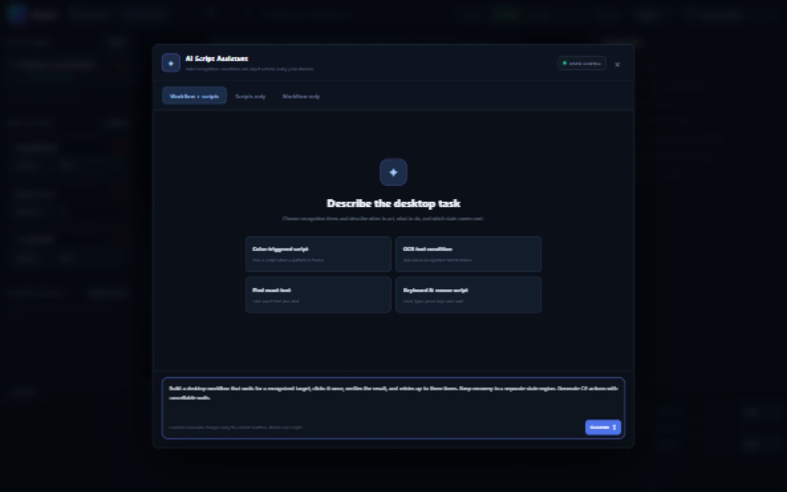

<div align="center">


### Desktop automation, in your orbit.

**Visual state machines · Living planets · Hot-reloadable C# · AI-assisted development**

**English** · [简体中文](README.zh-CN.md)


[Explore the workspace](#a-workspace-with-depth) · [Get started](#quick-start) · [Write C# actions](#extend-with-c) · [User guide](docs/guide.md)

</div>



Alcyone is a Windows desktop automation workspace where **you can see the logic you are building**. Connect state cards, recognize screen content, and run C# actions. When a workflow grows, fold related cards into named planets and keep the larger picture in view.

The canvas has depth. The execution stays explicit.

## A workspace with depth

### Less clutter. The same logic.

Box-select a set of cards and **Fold** them into a planet. Internal connections disappear into the group; external connections stay attached. Expand it to return to the original cards. Folding organizes the canvas—it does not replace states or change their execution order.

- **Work with a selection.** Fold, copy, delete, and expand from a contextual toolbar.
- **Move as a group.** Drag any selected card to move the selection together.
- **Grow an existing planet.** Drop selected cards onto it; the cards and connections animate into place.
- **Keep your layout.** Names, membership, appearances, positions, and collapsed states are saved with the workflow.



### Choose the world that fits your workflow.

Ocean, ice, lava, forest, violet clouds, ringed worlds—**12 selectable planet appearances**, with no random reassignment. Rename a planet and pick its surface from **Appearance**. Reopening a workflow, or unfolding and refolding the same group, keeps its identity.

Planets turn slowly while idle and accelerate when execution reaches a state inside them. Offscreen rendering pauses. Nebulae, distant star clusters, and foreground stars give the workspace a layered backdrop.



### A visual workspace. A programmable core.

| Capability | What you can build |
| :-- | :-- |
| **State machines** | Entry, loop, and exit actions; prioritized transitions with ALL / ANY conditions. |
| **C# hot reload** | Reusable `.csx` actions with parameters exposed in the UI. Failed compilation keeps the last working version. |
| **Screen recognition** | Multi-point color matching, dictionary OCR, and fixed-text searches, with embedded training tools. |
| **Independent state regions** | Separate current states with shared boolean, numeric, text, and JSON variables. |
| **Execution controls** | Run, step, stop, and reset; inspect state highlights, condition results, and logs. |
| **English & Chinese** | Switch the interface language without reloading the workflow. |

### Describe it. Review it. Make it run.

The optional AI assistant uses your current workflow, recognition library, and action catalog as context. Ask for scripts, a workflow, or both; review proposed changes before applying them. You can also build everything by hand.



<sub>Actual English-interface screenshots from the application’s local browser host. The workflow is a documentation example, not a live desktop automation run. The AI screenshot shows an unsent prompt; no generated result is implied.</sub>

<details>
<summary><strong>Open the workflow shown above</strong></summary>

Copy [orbital-workflow.json](docs/examples/orbital-workflow.json) into `StateMachineConfigs/` beside the executable, then select **orbital-workflow** from the configuration picker. For source builds, the executable is normally under `Alcyone/bin/Release/net10.0/win-x64/`.

This layout example contains no input actions or trained recognition data. Its transitions wait on the `TargetReady` variable, initially `false`.

</details>

## Canvas controls

| Gesture | Action |
| :-- | :-- |
| Left-drag on empty canvas | Box-select cards and planets |
| Right-drag | Pan the workspace |
| Ctrl + mouse wheel | Zoom |
| Drag a selected card | Move selected cards together |
| Drop selected cards onto a planet | Add them to that planet |
| Click a planet / double-click it | Select / expand |
| **Appearance**, or click the planet name | Choose a surface and rename it |

## Quick start

### Prerequisites

- Windows x64, the .NET 10 SDK, and WebView2 Runtime.
The required `FastColorFinder` sources are included in `Alcyone/Automation`, `Alcyone/Training/Core`, `Alcyone/Training/Services`, and `Alcyone/Training/Native`. This repository builds independently; no sibling source project is required.

### Launch the desktop app

From the repository root:

```powershell
dotnet restore Alcyone.slnx
dotnet run --project Alcyone/Alcyone.csproj -c Release
```

A standalone desktop window opens. For browser-based development:

```powershell
dotnet run --project Alcyone/Alcyone.csproj -c Release -- --browser-host
```

Open the local URL printed in the console. Screen capture and input operate on **the Windows desktop session hosting the service**.

### Configure AI (optional)

The app reads `AI:ApiKey`, `AI:Endpoint`, and `AI:Model`, with `DASHSCOPE_API_KEY` as a key fallback. Set environment variables in the same PowerShell session before launching:

```powershell
$env:AI__ApiKey = "<your-api-key>"
$env:AI__Endpoint = "https://dashscope.aliyuncs.com/compatible-mode/v1/chat/completions"
$env:AI__Model = "<model-id-available-to-your-account>"
dotnet run --project Alcyone/Alcyone.csproj -c Release
```

The endpoint must accept Chat Completions-compatible requests. AI requests send your instructions and current workflow context to the configured provider; proposed changes are previewed and applied in the UI. Keep credentials in local configuration or environment variables.

## Extend with C#

Save scripts in the application's `HotScripts/*.csx` directory. During source development, edit `Alcyone/HotScripts/` and relaunch to copy the scripts; live hot reload watches `HotScripts/` beside the executable.

```csharp
public sealed class MyActions : StateScript
{
    [StateAction("Click recognized target", "My scripts")]
    public async Task ClickTarget([StateParameter("Recognition item")] string name)
    {
        var hit = await Api.Recognition.FindAsync(name, seconds: 3);
        if (!hit.Found) return;

        Api.Input.Click(hit.X, hit.Y);
        await Api.Delay(200);
        Vars.Set("Finished", true);
        Log("Target clicked");
    }
}
```

Bind actions to state entry, loop, or exit stages. Scripts can access desktop input, recognition, shared variables, logging, and cancellable waits. See the [scripting guide and API reference](docs/guide.md#scripting-api).

## Build & distribute

```powershell
# Build
dotnet build Alcyone.slnx -c Release

# Publish a framework-dependent desktop distribution
dotnet publish Alcyone/Alcyone.csproj -c Release --self-contained false -o Desktop

# Verify scripts, pages, and UI assets
dotnet Desktop/Alcyone.dll --check-host
```

Launch `Desktop/Alcyone.exe` and distribute the entire folder. The target machine needs the .NET 10 ASP.NET Core Runtime and WebView2. Published builds do not need the `FastColorFinder` source directory.

<details>
<summary><strong>Publish a self-contained single-file EXE</strong></summary>

```powershell
dotnet publish Alcyone/Alcyone.csproj -c Release -r win-x64 --self-contained true -p:PublishSingleFile=true -p:IncludeAllContentForSelfExtract=true -p:PublishTrimmed=false -p:DebugType=None -p:DebugSymbols=false -o release-exe
```

This includes the .NET runtime; WebView2 is still required. Embedded resources may be extracted on first launch. Editable scripts and configurations live beside the executable.

</details>

## Explore further

| Resource | Contents |
| :-- | :-- |
| [User guide](docs/guide.md) | Recognition imports, training, conditions, scripting API, and runtime behavior |
| [中文使用指南](docs/guide.zh-CN.md) | Detailed Chinese documentation |
| [HotScripts](Alcyone/HotScripts) | Built-in C# action examples |
| [Execution](Alcyone/Execution) | Background state machine runtime |
| [Training](Alcyone/Training) | Embedded recognition training integration |

Refreshing the page or switching configurations keeps existing runtime instances alive. Use **Stop** to end execution. Closing the app releases the instances; restarting does not resume them automatically.

## Contributing

Ideas, bug reports, and pull requests are welcome. Open an [issue](https://github.com/anan1213095357/Alcyone/issues) with your Windows / .NET versions, reproduction steps, and sanitized logs or a minimal workflow.

If Alcyone fits the way you think about automation, give it a Star to help others discover it.

<sub>This repository does not currently include a LICENSE file; usage and distribution terms have yet to be specified by the maintainer.</sub>
