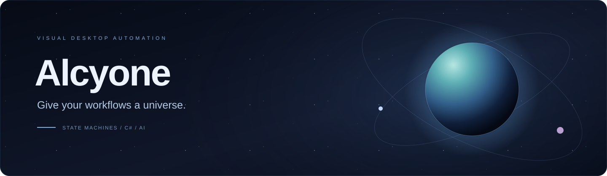
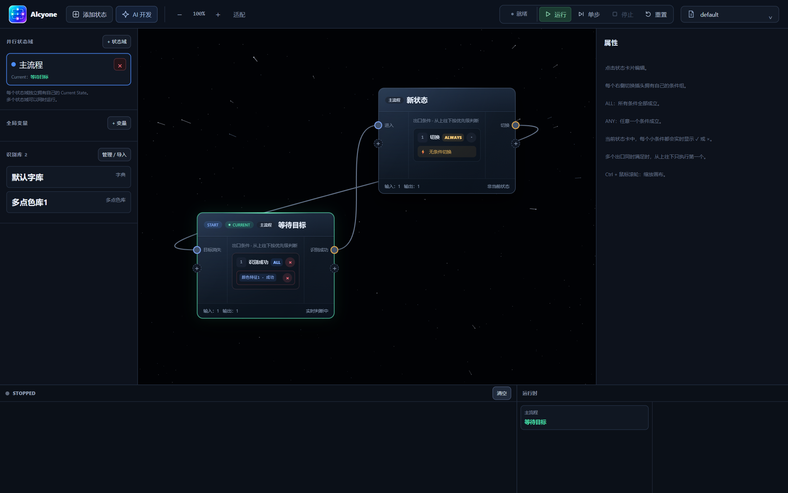
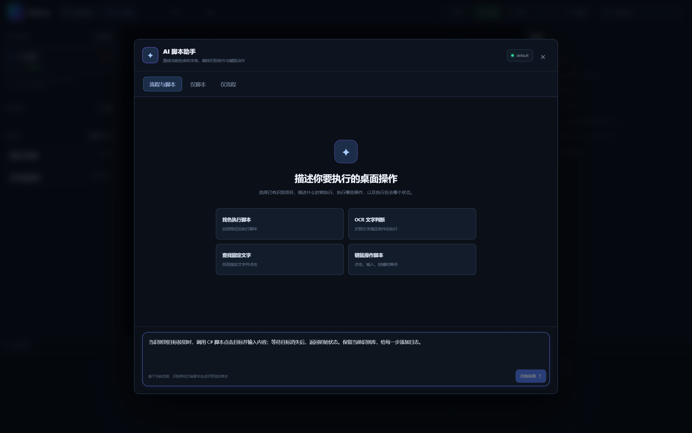
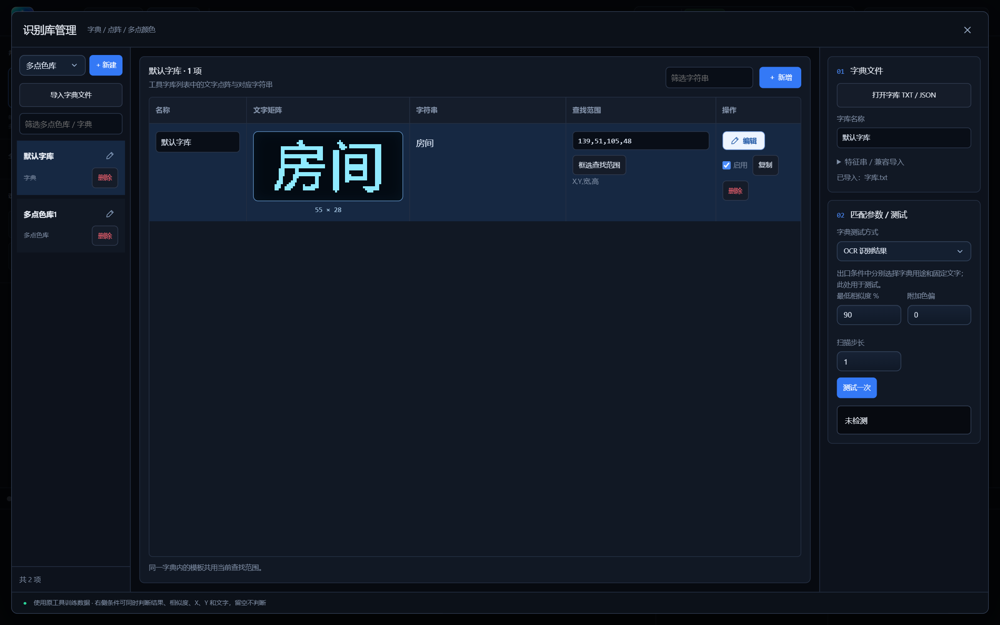

<div align="center">



**Simple actions. Complex automation.**

Write scripts with AI. Organize logic with states. Connect it all to your desktop.

**English** · [简体中文](README.zh-CN.md)


[Highlights](#highlights) · [A closer look](#a-closer-look) · [Quick start](#quick-start) · [User guide](docs/guide.md)

</div>

---

Alcyone is a Windows desktop automation workspace that brings **AI-assisted development, visual state machines, and hot-reloadable C# scripts** together. Clicks, keystrokes, and waits become reusable actions. Conditions, branches, loops, and parallel state regions turn those actions into workflows.

Start with “find this button and click it.” Build toward “recognize text, evaluate conditions, execute a script, and wait for the screen to change.” Inspect and edit each state and transition on the canvas.



## Highlights

| | Capability | What it enables |
| :-- | :-- | :-- |
| ✦ | **AI script assistant** | Describe a task, generate a workflow, C# scripts, or both, then preview and apply the changes. |
| ◈ | **Visual state machines** | Connect states, combine ALL / ANY conditions, and prioritize outgoing transitions. |
| ⌘ | **C# hot reload** | Edit `.csx` files and expose parameters in the UI. Failed compilation keeps the last working version. |
| ◎ | **Screen recognition** | Use multi-point colors, dictionary OCR, and fixed-text searches to drive transitions. |
| ⑂ | **Parallel state regions** | Give each region its own current state and share numeric, boolean, text, and JSON variables. |
| ▷ | **Execution controls** | Run, step, stop, and reset with current-state highlighting and execution logs. |

## From idea to automation

```text
Describe → Generate scripts / states → Preview & apply → Connect & configure → Run / step
                                                               ↑                │
                                                               └─ Inspect & edit┘
```

You can also build workflows and write scripts by hand. AI assistance is optional.

1. **Prepare recognition items.** Import or train dictionaries and color patterns, then set search regions.
2. **Build the workflow.** Add states, configure entry / loop / exit actions, and connect transitions.
3. **Define conditions.** Combine variables with recognition status, similarity, coordinates, and text.
4. **Inspect execution.** Step through the logic before running continuously; use logs to diagnose behavior.

## A closer look

### Describe what should happen

The assistant uses the current workflow, recognition library, and action catalog as context. Choose workflow + scripts, scripts only, or workflow only.



### Turn screen content into conditions

Manage dictionaries, multi-point colors, search regions, and matching parameters in one place. Training and testing are embedded in the app.



<sub>Actual application screenshots; the current UI is primarily Chinese. The AI screenshot shows prompt composition, without a model call or generated result.</sub>

## Quick start

### Prerequisites

- Windows x64, the .NET 10 SDK, and WebView2 Runtime.
- **The `FastColorFinder` source dependency.** The project links its source files using relative paths. Supply the complete directory beside this repository; it is not bundled in this repository yet.

```text
workspace/
├── Alcyone/                  # This repository; folder name may vary
│   ├── Alcyone.slnx
│   └── Alcyone/Alcyone.csproj
└── FastColorFinder/          # Required to build
    ├── FastColorFinder.cs
    ├── Core/
    ├── Services/
    └── Native/
```

### Launch the desktop app

From the repository root:

```powershell
dotnet restore Alcyone.slnx
dotnet run --project Alcyone/Alcyone.csproj -c Release
```

A standalone desktop window opens. For browser-based development:

```powershell
dotnet run --project Alcyone/Alcyone.csproj -c Release -- --browser-host
```

Open the local URL printed in the console. Screen capture and input operate on **the Windows desktop session hosting the service**.

### Configure AI (optional)

The app reads `AI:ApiKey`, `AI:Endpoint`, and `AI:Model`, with `DASHSCOPE_API_KEY` as a key fallback. Set environment variables in the same PowerShell session before launching:

```powershell
$env:AI__ApiKey = "<your-api-key>"
$env:AI__Endpoint = "https://dashscope.aliyuncs.com/compatible-mode/v1/chat/completions"
$env:AI__Model = "<model-id-available-to-your-account>"
dotnet run --project Alcyone/Alcyone.csproj -c Release
```

The endpoint must accept Chat Completions-compatible requests. AI requests send your instructions and current workflow context to the configured provider; proposed changes are previewed and applied in the UI. Keep credentials in local configuration or environment variables.

## Extend with C#

Save scripts in the application's `HotScripts/*.csx` directory. During source development, edit `Alcyone/HotScripts/` and relaunch to copy the scripts; live hot reload watches `HotScripts/` beside the executable.

```csharp
public sealed class MyActions : StateScript
{
    [StateAction("Click recognized target", "My scripts")]
    public async Task ClickTarget([StateParameter("Recognition item")] string name)
    {
        var hit = await Api.Recognition.FindAsync(name, seconds: 3);
        if (!hit.Found) return;

        Api.Input.Click(hit.X, hit.Y);
        await Api.Delay(200);
        Vars.Set("Finished", true);
        Log("Target clicked");
    }
}
```

Bind actions to state entry, loop, or exit stages. Scripts can access desktop input, recognition, shared variables, logging, and cancellable waits. See the [scripting guide and API reference](docs/guide.md#scripting-api).

## Build & distribute

```powershell
# Build
dotnet build Alcyone.slnx -c Release

# Publish a framework-dependent desktop distribution
dotnet publish Alcyone/Alcyone.csproj -c Release --self-contained false -o Desktop

# Verify scripts, pages, and UI assets
dotnet Desktop/Alcyone.dll --check-host
```

Launch `Desktop/Alcyone.exe` and distribute the entire folder. The target machine needs the .NET 10 ASP.NET Core Runtime and WebView2. Published builds do not need the `FastColorFinder` source directory.

<details>
<summary><strong>Publish a self-contained single-file EXE</strong></summary>

```powershell
dotnet publish Alcyone/Alcyone.csproj -c Release -r win-x64 --self-contained true -p:PublishSingleFile=true -p:IncludeAllContentForSelfExtract=true -p:PublishTrimmed=false -p:DebugType=None -p:DebugSymbols=false -o release-exe
```

This includes the .NET runtime; WebView2 is still required. Embedded resources may be extracted on first launch. Editable scripts and configurations live beside the executable.

</details>

## Explore further

| Resource | Contents |
| :-- | :-- |
| [User guide](docs/guide.md) | Recognition imports, training, conditions, scripting API, and runtime behavior |
| [中文使用指南](docs/guide.zh-CN.md) | Detailed Chinese documentation |
| [HotScripts](Alcyone/HotScripts) | Built-in C# action examples |
| [Execution](Alcyone/Execution) | Background state machine runtime |
| [Training](Alcyone/Training) | Embedded recognition training integration |

Refreshing the page or switching configurations keeps existing runtime instances alive. Use **Stop** to end execution. Closing the app releases the instances; restarting does not resume them automatically.

## Contributing

Ideas, bug reports, and pull requests are welcome. Open an [issue](https://github.com/anan1213095357/Alcyone/issues) with your Windows / .NET versions, reproduction steps, and sanitized logs or a minimal workflow.

If Alcyone fits the way you think about automation, give it a Star to help others discover it.

<sub>This repository does not currently include a LICENSE file; usage and distribution terms have yet to be specified by the maintainer.</sub>
